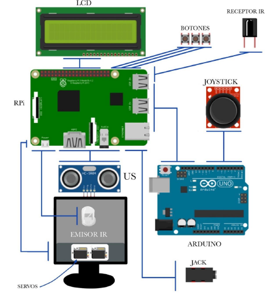

# piTankGo
Proyecto piTankGo: manejo de una torreta a través de una Raspberry Pi. Programa escrito en C.

- Control a través de teclado matricial disponible.

- Control a través de un joystick analógico (convertido a digital a través de un arduino) disponible.

- La torreta dispone de un led infrarrojo. Al disparar la torreta, este led se encenderá. Al activar el disparo, se reproduce un efecto asociado a este.

- Si la torreta dispara y acierta en el objetivo (led fotodiodo receptor), el programa registrará el derribo del objetivo. Al detectar un impacto, se reproduce un efecto asociado a este.

- Sensor de ultrasonidos programado para que dispare la torreta automáticamente cuando encuentre un objeto a una distancia pequeña.

- Display LCD muestra información útil del sistema y del juego.

- Botones para iniciar el juego, terminar el juego y terminar el programa. Otro botón para cambiar la canción que suena de fondo.

- Cuando se inicia el juego, empezará a sonar una canción de fondo. Esta canción se pausará mientras se realice un disparo o se detecte un impacto, reproduciendose así el efecto.

# Distribución proyecto

- La carpeta piTankGo_1 contiene el código a cargar en la Raspberry Pi.
- La carpeta Joystick-Torreta contiene el código a cargar en Arduino.
- La carpeta Archuvos 3d contiene los archivos .stl de la torreta usada.

# Manual de usuario

El usuario solo se tendrá que preocupar de lo redondeado en la siguiente imagen:

Según se carga el juego, el usuario verá en la pantalla el siguiente mensaje: “Iniciando el sistema…”

En ese momento deberá pulsar el botón 1 para iniciar el juego (empezará a sonar la canción de fondo). Entonces le aparecerá en la pantalla información sobre el número de disparos realizados, el número de impactos detectados, la canción que está sonando y la distancia que miden los ultrasonidos.

Con el Joystick podrá manejar la orientación de la torreta, y pulsando el mismo, podrá realizar un disparo, aumentando en 1 el número de disparos realizados. Además, se reproducirá el efecto disparo.

El objetivo es el fotodiodo de color negro colocado sobre la pequeña protoboard, si consigue impactar el disparo (para ello, tiene que apuntar en la dirección en la que está orientado el fotodiodo), aumentará en 1 el número de impactos. Además, se reproducirá el efecto de impacto.

Si el usuario mueve el joystick hacia el objetivo (que suponemos que se puede mover) y este se encuentra ahora a menos de 7 cm, el programa realizará el disparo automáticamente.

Si realiza 10 disparos, el jugador perderá la partida y se pausará el juego. De igual manera, si el usuario impacta 5 veces (antes de realizar 10 disparos), este ganará la partida. En cualquier caso, aparecerá por pantalla lo siguiente: “Se ha pausado el juego”. Si vuelve a dar al botón 1, se reiniciará el juego, con los contadores a 0.

Si el usuario pulsa el botón 2, cambiará la canción que suena de fondo y se indicará cual es en la pantalla.

Si el usuario pulsa el botón 3, el juego terminará y no se podrá volver a jugar hasta que no se cargue de nuevo el mismo. Además, aparecerá por pantalla lo siguiente: “Juego finalizado!”.

# Distribución de pines de la Raspberry Pi

# Descripción de la torreta y del sistema hardware

Sistema Hardware:

Torreta (motores usados: SG90): 

